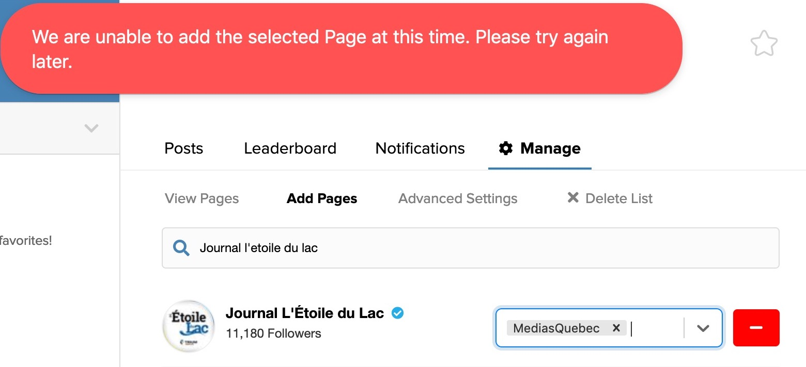

# FacebookQuebec2021-2022

Les métadonnées complètes de l'activité de 274 pages Facebook de médias du Québec entre le 1er juillet 2021 et le 30 juin 2022 se trouvent dans le fichier&nbsp;:

**[fbQc2021-2022.csv](fbQc2021-2022.csv)**.

Données colligées dans le cadre d'un dossier pour le magazine [*Le Trente*](https://www.fpjq.org/fr/acheter-le-trente-en-format-papier), édition 2022.

Un dossier semblable avait été réalisé l'année précédente. Les principales différences sont qu'environ une dizaine de médias ont été ajoutés, surtout des sites web locaux et des hebdos régionaux.

Certains médias présents l'année dernière ont cependant disparu en raison de problèmes techniques dans l'interface web de l'outil [CrowdTangle](https://www.crowdtangle.com/), utilisé pour la collecte de données. Lorsque j'essaie de les ajouter, j'obtiens systématiquement l'erreur qu'on voit sur cette capture d'écran&nbsp;:

Les médias en cause sont notamment&nbsp;:

* [*L'actualité*](https://www.facebook.com/lactualite)
* [CTV Montreal](https://www.facebook.com/ctvmontreal)
* Les journaux de Trium Médias&nbsp;:
  * [*L'Étoile du Lac*](https://www.facebook.com/letoiledulac)
  * [*Le Lac Saint-Jean*](https://www.facebook.com/lelacstjean)
  * [*Nouvelles Hebdo*](https://www.facebook.com/Nouvelleshebdo)
  * [*Le Réveil*](https://www.facebook.com/lereveiljournal)
